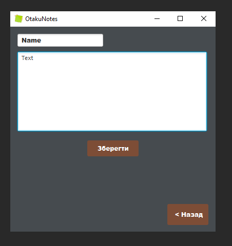
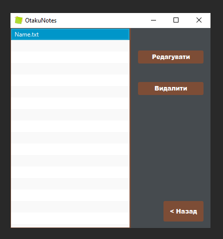

<p align="center"></p>
<h1 align="center">MyNotes</h1>

## Description
<b>EN:</b>

This is my note program using JavaFx.

To save my notes, I decided to create a computer program for this requirement. All notes are stored in the "\ Documents \ OtakuNotes \" directory. This 
program may not work correctly on Linux operating systems.

<b>UA:</b>

Це моя програма для заміток з використанням JavaFx.

Для збереження своїх заміток, я вирішив створити комп'ютерну програму для даної вимоги. Всі замітки зберігаються в директорії ***"\Documents\OtakuNotes\\"***. Можлива не 
коректна робота даної програми на операційних системах типу **Linux**.

#
## Screenshots
<p>
  
  
  
</p>

#
## Technologies used
<b>EN:</b>
- Using the JavaFX library to create a graphical user interface
- Work with files

<b>UA:</b>
- Використання бібліотеки JavaFX для створення графічного користувацького інтерфейсу
- Робота з файлами
#
## License
```
© 2020, CoolOtaku (ericspz531@gmail.com)
```
